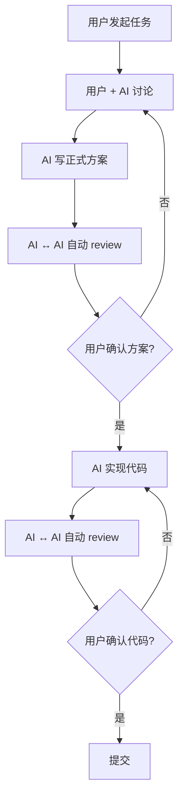
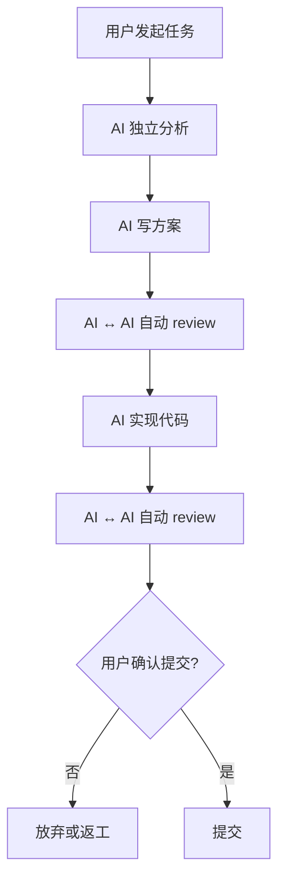

# 工作流模式对比

## 快速选择

| 场景 | 推荐模式 |
|------|---------|
| 重构、架构设计 | 👥 **普通模式** |
| 新功能开发（复杂） | 👥 **普通模式** |
| Bug 修复（简单明确） | 🚀 **YOLO 模式** |
| 小改动、单点修改 | 🚀 **YOLO 模式** |
| 第一次接触代码库 | 👥 **普通模式** |
| 熟悉的重复性任务 | 🚀 **YOLO 模式** |

## 详细对比

### 👥 普通模式（Normal Mode）

**命令：** `/workflow <任务> <执行者>`

**特点：你是主导，AI 是助手**

#### 用户参与度：⭐⭐⭐
- ✅ 与 AI 对话讨论需求
- ✅ 共同设计技术方案
- ✅ 确认最终方案
- ✅ 确认代码实现
- ✅ 确认提交

#### 工作流程



#### 示例对话

```
User: /workflow 重构用户认证系统 claude

Claude: 让我先了解一下需求：
1. 当前认证系统有什么问题？
2. 你倾向于用 JWT 还是 session？
3. 需要支持 SSO 吗？
4. 性能目标是什么？

User:
1. 现在是session，性能不好，水平扩展困难
2. 倾向JWT
3. 暂时不需要SSO
4. QPS要提升到5000+

Claude: 明白了。基于你的需求，我有两个方案：

方案A：纯 JWT + Refresh Token
- 优点：无状态，易扩展，性能最好
- 缺点：无法主动废除token，需要等过期
- 适合：你的场景

方案B：JWT + Redis 黑名单
- 优点：可以主动废除，安全性更好
- 缺点：引入Redis依赖，部分有状态
- 适合：对安全要求极高的场景

你倾向哪个？

User: 方案A吧，我们可以通过短过期时间 + refresh token 来解决安全问题

Claude: 好的！我来写详细方案...
[写方案]
[自动调用 Cursor Agent review，讨论3轮优化]

Claude: ✅ 方案已完成并经过 Cursor Agent 审核！

核心设计：
- Access token 15分钟过期
- Refresh token 7天过期 + rotation
- Token存储：不存储，纯JWT验证
- 性能预估：QPS 10000+（比现在提升5倍）

风险点：
- Token泄露窗口期15分钟（可接受）
- 需要客户端处理refresh逻辑

📄 完整方案：.workflow/plans/xxx/proposal-final.md
📝 Cursor 审核意见：.workflow/plans/xxx/review-3.md

确认开始编码吗？(yes/no)

User: yes

Claude: 开始实现...
[写代码]
[自动调用 Cursor review code，修复2轮issue]

Claude: ✅ 实现完成并经过 Cursor Agent 代码审核！

修改文件：
- src/auth/jwt.service.ts (新建，JWT核心逻辑)
- src/auth/auth.controller.ts (改造，新增refresh端点)
- src/middleware/auth.middleware.ts (重构，JWT验证)
- tests/auth/jwt.test.ts (新建，90%覆盖率)

测试结果：
- ✅ 所有单元测试通过 (45个)
- ✅ 集成测试通过 (12个)
- ✅ 压测达标 QPS 12000

📊 完整 diff：.workflow/plans/xxx/final.diff
📝 Cursor 代码审核：.workflow/plans/xxx/code-review-2.md

确认提交吗？(yes/no)

User: yes

Claude: [创建 commit，包含详细说明]
完成！🎉
```

**时间：** 10-30 分钟（取决于任务复杂度和讨论深度）

**适合：**
- ✅ 复杂任务，需要你参与决策
- ✅ 架构级改动，影响面大
- ✅ 新项目，不熟悉代码库
- ✅ 需求不明确，需要讨论
- ✅ 你想学习和理解实现

---

### 🚀 YOLO 模式（YOLO Mode）

**命令：** `/workflow-yolo <任务> <执行者>`

**特点：AI 完全自主，你只负责批准**

#### 用户参与度：⭐
- ❌ 不参与讨论
- ❌ 不参与设计
- ❌ 不参与review
- ✅ 只确认最终提交

#### 工作流程



#### 示例对话

```
User: /workflow-yolo 修复用户头像上传失败的bug cursor

[Cursor Agent 完全自主工作]
[分析问题]
[写方案]
[与 Claude 讨论方案，3轮]
[实现代码]
[与 Claude code review，2轮]
[运行测试]

Cursor: ✅ Bug 已修复并经过 Claude 审核！

问题根因：
- 文件上传中间件只允许 jpg/png，不支持 webp
- 前端在上传 webp 时被服务端拒绝

解决方案：
- 在 ALLOWED_MIME_TYPES 中添加 image/webp
- 更新文件大小限制为 5MB（之前3MB）
- 添加 webp 上传的测试用例

修改文件：
- src/middleware/upload.middleware.ts (8行)
- tests/upload/upload.test.ts (新增1个测试)

测试：
- ✅ 单元测试全部通过
- ✅ 手动上传 webp 成功

审核轮次：
- 方案审核：3轮（Claude 提出了边界情况处理建议）
- 代码审核：2轮（Claude 建议添加文件类型验证）

📄 完整记录：.workflow/plans/xxx/
📊 Diff：.workflow/plans/xxx/final.diff

确认提交吗？(yes/no)

User: yes

Cursor: [提交] 完成！🎉
```

**时间：** 5-15 分钟（完全自动，速度快）

**适合：**
- ✅ 简单 bug 修复
- ✅ 明确的小功能
- ✅ 熟悉的重复性工作
- ✅ 单点修改，影响面小
- ✅ 你完全信任 AI 的判断

---

## 核心区别

| 维度 | 👥 普通模式 | 🚀 YOLO 模式 |
|------|-----------|-------------|
| **用户参与** | 高 - 共同设计 | 低 - 只批准结果 |
| **决策点** | 3次（方案前/方案后/代码后） | 1次（提交前） |
| **AI讨论** | 用户看不到，自动进行 | 用户看不到，自动进行 |
| **速度** | 中等（需要对话） | 快（无需等待用户） |
| **控制度** | 高 - 你主导方向 | 低 - AI自主决策 |
| **学习价值** | 高 - 参与过程 | 低 - 只看结果 |
| **风险** | 低 - 多次确认 | 中 - 一次性批准 |
| **适用场景** | 复杂/重要任务 | 简单/常规任务 |

## 共同点

两种模式都保证：
- ✅ **双 AI 互审** - 执行者和观察者必须都同意
- ✅ **完整记录** - 所有方案、review、代码都保存
- ✅ **无需手动切换** - AI 之间自动通信
- ✅ **Git 集成** - 最终生成规范的 commit

## 选择建议

### 何时用普通模式？

1. **复杂度高** - 涉及架构、多模块、核心逻辑
2. **影响面大** - 可能影响多个团队或系统
3. **需求不明** - 你还没完全想清楚怎么做
4. **新代码库** - 第一次接触这个项目
5. **学习导向** - 你想理解实现细节

### 何时用 YOLO 模式？

1. **简单明确** - 需求清晰，实现路径单一
2. **影响面小** - 只改几个文件，不影响其他模块
3. **时间紧急** - 需要快速完成
4. **重复性** - 类似的任务做过很多次
5. **信任度高** - 你完全信任 AI 能处理好

### 灰色地带怎么办？

- **试试普通模式** - 如果 AI 问的问题你都能快速回答，说明适合
- **观察第一轮对话** - 如果 AI 问了很多你答不上来的问题，说明需求还不够明确
- **可以中途切换** - 普通模式讨论清楚后，剩下的可以让 AI 自主完成

## 实战技巧

### 普通模式技巧

1. **准备好背景信息** - 在对话前整理好需求、限制条件
2. **主动说出你的考虑** - 不要只回答问题，也说出你的想法
3. **设置边界** - 告诉 AI 什么能改，什么不能动
4. **分阶段确认** - 方案阶段不满意，勇敢说 no

### YOLO 模式技巧

1. **任务描述要精确** - 因为 AI 不会问你，所以要说清楚
2. **选对执行者** - Claude 适合重构，Cursor 适合功能实现
3. **检查结果** - 虽然有双 AI 审核，但你还是要看 diff
4. **建立信任** - 从小任务开始，逐步扩大使用范围

## 安全网

两种模式都有：
- 📁 **完整审计** - `.workflow/plans/<task-id>/` 保存所有过程
- 🔄 **Git 可回滚** - 提交后发现问题可以 revert
- 🛑 **5轮上限** - AI 讨论超过5轮会暂停，报告给你
- 👀 **Diff 可见** - 提交前你一定能看到改了什么

## 总结

```bash
# 不确定用哪个？默认用普通模式
/workflow <任务> <执行者>

# 确定任务简单明确？用 YOLO
/workflow-yolo <任务> <执行者>

# 还是不确定？先用普通模式，讨论两句就知道了
```

**记住：普通模式你是船长，YOLO模式你是乘客。**
